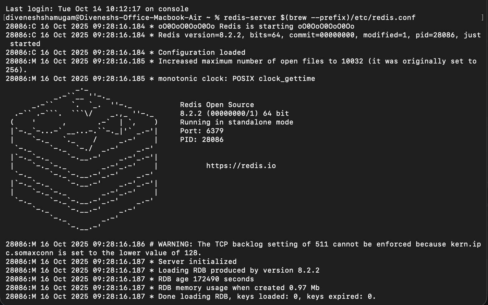
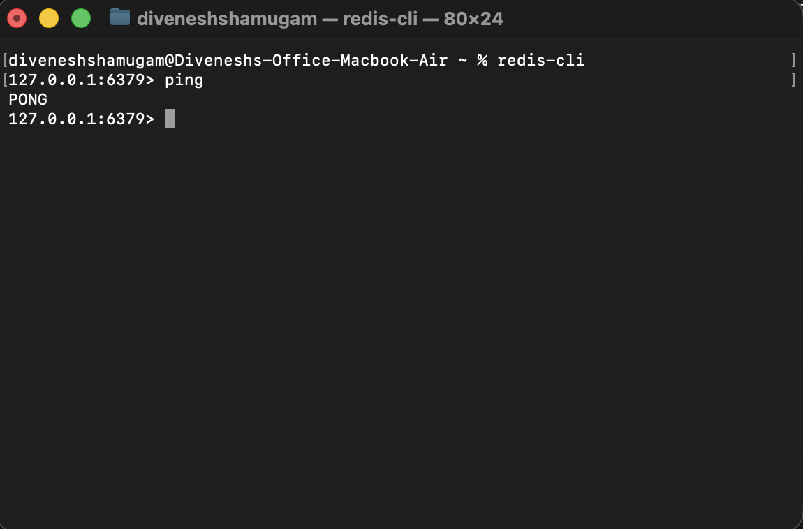
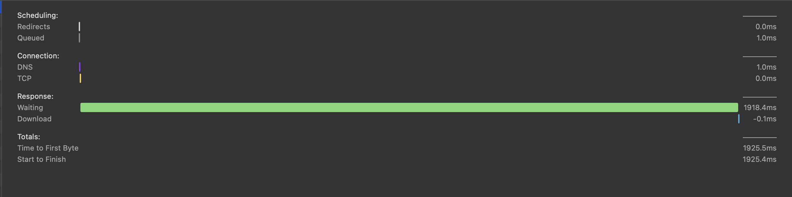
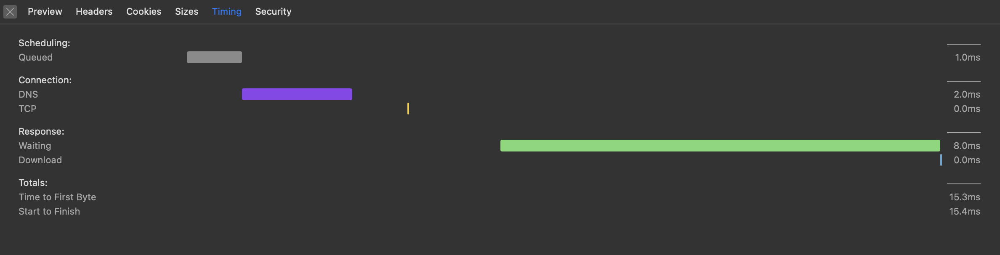

## 🚀 Redis Learning Project

### 🧠 Why Redis?

**Redis** is an open-source, **in-memory data store** commonly used for **caching** data from databases to achieve **faster retrieval** and **improved performance**.
It’s especially suitable for **enterprise-level applications** that handle **large amounts of data**, where response time and scalability are crucial.

### 💡 Benefits of Using Redis

  * **⚡ Blazing Fast Performance** – Redis stores data in memory, enabling significantly faster responses compared to traditional databases.
  * **🧩 Simple Commands** – Redis provides an intuitive command-line interface with easy-to-learn commands for data manipulation.
  * **🔁 Real-Time Processing** – With its **publish/subscribe (Pub/Sub)** feature, Redis supports real-time event-driven applications and message broadcasting.

### ⚠️ Important Notes

  * Redis stores data **in memory (RAM)**, meaning data can be **lost** during **system failures or restarts** unless persistence is configured.
  * **Do not use Redis as a replacement** for your main database. It should serve as a **temporary cache layer** to improve performance.
  * To prevent **memory overflow**, always set **expiration times (TTL)** for cached keys.
  * Misconfiguration or improper usage can lead to **buffer overflows** and degraded performance.

-----

## 🧰 How to Run the Program

### 1\. Install Redis

Visit the official Redis documentation to install it on your machine:
👉 [https://redis.io/docs/latest/get-started/](https://redis.io/docs/latest/get-started/)

For **macOS** users, you can install Redis using **Homebrew**:

```bash
brew install redis
```

### 2\. Start the Redis Server

Run the Redis server in the background:

```bash
redis-server
```



### 3\. Verify Redis Installation

Open a new terminal window and test the connection:

```bash
redis-cli
ping
```

If the Redis server is running successfully, you’ll get the response:

```
PONG
```



### 4\. Run the Web Application

1.  Open this project in **Visual Studio Code**.

2.  Install dependencies (if not already installed):

    ```bash
    npm install
    ```

3.  Start the server:

    ```bash
    npm start
    ```

4.  Open your browser and visit:
    👉 **http://localhost:3000**

You’ll see a webpage displaying **country flags** and **names** retrieved from an API.

-----

## ⚙️ How Redis Caching Works

  * When the page is loaded for the first time, data is **fetched from the external API**.
  * The system then **stores the fetched data in Redis** as cache.
  * On subsequent reloads, the application **retrieves the data directly from Redis** instead of calling the API again — resulting in **much faster response times**.

### 📊 Output


| **🕒 Before Caching** | Data is fetched directly from the API. | Slower response time up to 1918ms





| **⚡ After Caching** | Data is retrieved instantly from Redis memory. | Faster response time reduced to 8ms



